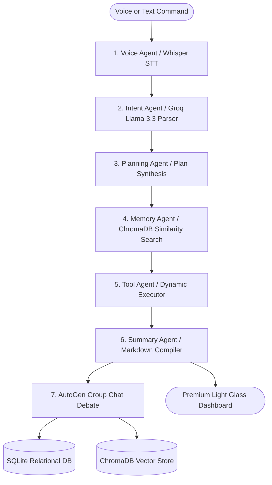
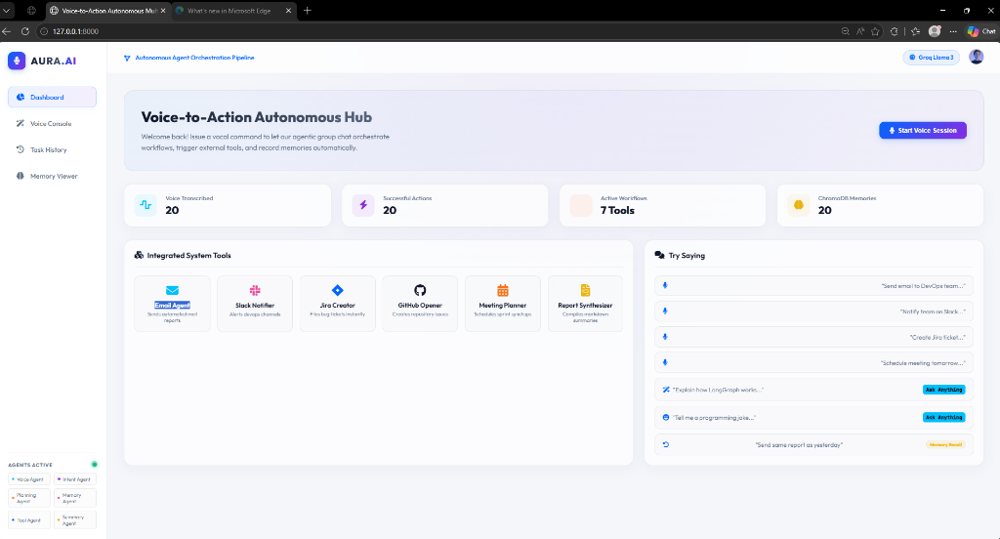
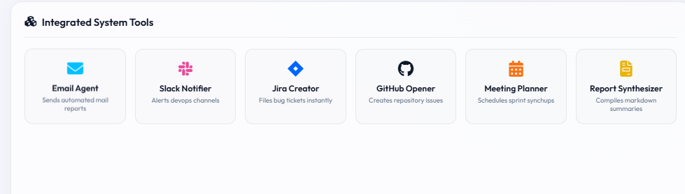
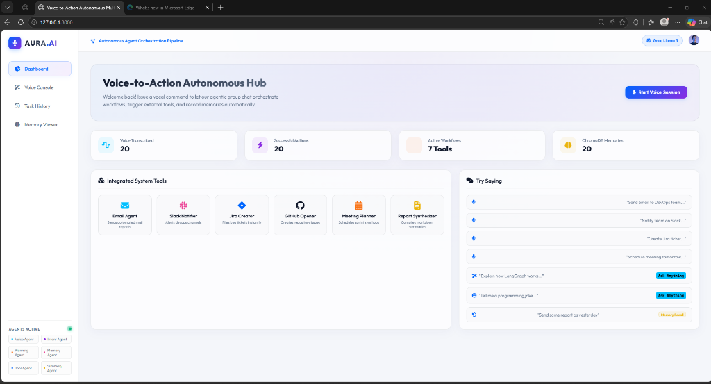
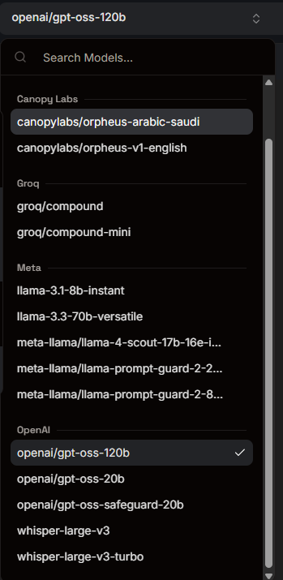
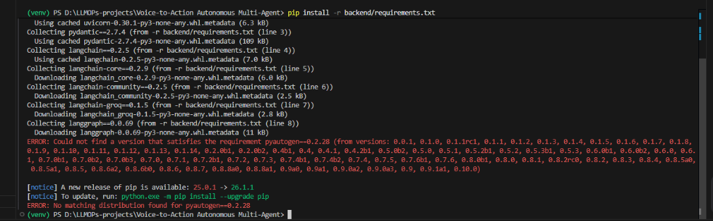

# AURA.AI: Enterprise Voice-to-Action Autonomous Multi-Agent Orchestrator

<p align="center">
  
</p>

<p align="center">
  <strong>An Intelligent Cognitive Workflow Engine & Collaborative Multi-Agent Platform</strong>
</p>

<p align="center">
  <a href="https://www.python.org/"></a>
  <a href="https://fastapi.tiangolo.com/"></a>
  <a href="https://www.langchain.com/"></a>
  <a href="https://github.com/microsoft/autogen"></a>
  <a href="https://opensource.org/licenses/MIT"></a>
</p>

---

## 📖 Table of Contents
1. [Executive Abstract](#-executive-abstract)
2. [Key Features](#-key-features)
3. [System & Multi-Agent Architecture](#-system--multi-agent-architecture)
4. [Enterprise Design Patterns](#-enterprise-design-patterns)
5. [Setup & Installation Instructions](#-setup--installation-instructions)
6. [API Specifications](#-api-specifications)
7. [User Interface Highlights](#-user-interface-highlights)
8. [Contribution Guidelines](#-contribution-guidelines)
9. [Developer Signature](#-developer-signature)

---

## 🧠 Executive Abstract

**AURA.AI** is a cutting-edge full-stack cognitive task orchestrator that translates real-time vocal audio commands into deterministic system actions. Combining the speed of **Groq’s cloud-hosted inference** with the stateful, cyclic orchestration power of **LangGraph**, Aura.AI seamlessly routes inputs through standard API integrations or fallbacks to high-intelligence conversational responses. When technical complexity demands collaborative resolution, the system leverages **Microsoft AutoGen Group Chat Agents** to model inter-agent debates, ensuring all tasks are audited before final persistence inside SQLite and ChromaDB memory banks.

---

## 🌟 Key Features

### 🎙️ Advanced Acoustic Pipeline
- **Real-Time Voice Streaming**: Capture high-fidelity voice inputs using HTML5 browser microphone APIs.
- **Sub-Second Whisper Inference**: Transcribes raw audio streams into clean text using Groq's high-speed **Whisper Large v3** endpoint.

### 🧩 Stateful Multi-Agent Orchestration (LangGraph)
- **Voice Agent Node**: Manages voice transcript ingestion and stream processing.
- **Intent Agent Node**: Decouples audio signals into deterministic categories using **Llama 3.3 (70B)** parsing.
- **Planning Agent Node**: Synthesizes structured, incremental plans based on goal complexity.
- **Memory Agent Node**: Performs similarity search against historic runs to automatically reuse parameters (e.g., *"same as yesterday"* triggers contextual retrieval).
- **Tool Agent Node**: Executes custom integration scripts securely.
- **Summary Node**: Compiles operation logs and synthesizes Markdown executive summaries.

### 🤝 Multi-Agent Collaborative Group Chat (AutoGen)
- **Project Manager Agent**: Translates intentions into tactical blueprints.
- **DevOps Agent**: Reviews infrastructure, configuration parameters, and execution environments.
- **QA Agent**: Audits error boundaries and verifies success criteria.

### 💾 Robust Persistence Layer
- **ChromaDB Vector Store**: Maintains a long-term semantic memory bank with cosine similarity indexing.
- **SQLite Database Historian**: Stores historical run logs, parameter structures, final summaries, and agent interactions.

---

## 🏛️ System & Multi-Agent Architecture

The stateful orchestration is managed as a cyclic Directed Acyclic Graph (DAG) using **LangGraph**:



### Supported Integration Tools
- ✉️ **Email Agent**: Dispatches automated structured emails.
- 💬 **Slack Notifier**: Alerts channels with operational updates.
- 🎫 **Jira Creator**: Registers bugs and tracking tasks.
- 🐙 **GitHub Opener**: Opens repository issues.
- 📅 **Meeting Planner**: Books developer calendar slots.
- 📊 **Report Synthesizer**: Compiles rich Markdown metrics documents.
- 🔍 **Search Tool**: Queries online technical documentation.

---

## 🛠️ Setup & Installation Instructions

### Prerequisites
- **Python 3.10+** (Python 3.13 supported out-of-the-box)
- **pip** and **virtualenv**

### 1. Repository Initialization
Initialize your environment in your project folder:
```powershell
# Create virtual environment
python -m venv venv
venv\Scripts\activate

# Install requirements
pip install -r backend/requirements.txt
```

### 2. Environment Variables Configuration
Configure a `.env` file in the root folder with the following variables:
```env
GROQ_API_KEY=your_groq_api_key_here
GROQ_LLM_MODEL=llama-3.3-70b-versatile
GROQ_WHISPER_MODEL=whisper-large-v3
```
*Note: AURA.AI includes built-in simulation modules. If keys are missing, the system automatically runs in offline high-fidelity demonstration mode.*

### 3. Execution
Start the development server:
```powershell
python -m uvicorn backend.app:app --reload --host 127.0.0.1 --port 8000
```
Visit **[http://127.0.0.1:8000](http://127.0.0.1:8000)** to access the live dashboard.

---

## 🔌 API Specifications

| Method | Endpoint | Description | Payload Type |
| :--- | :--- | :--- | :--- |
| `POST` | `/transcribe` | Transcribes audio file inputs using Whisper Large v3 | `multipart/form-data` |
| `POST` | `/execute` | Processes commands through LangGraph + AutoGen flow | `application/json` |
| `POST` | `/memory/store` | Indexes a custom executive summary into ChromaDB | `application/json` |
| `POST` | `/memory/search` | Performs similarity queries against ChromaDB embeddings | `application/json` |
| `GET` | `/history` | Fetches historical runs from local SQLite database | N/A |

---

## 📸 Step-by-Step UI & Visual Walkthrough

Experience a complete visual tour of **AURA.AI**'s enterprise workflow capabilities, designed with a premium light glassmorphism aesthetic:

### 🌟 Step 1: Interactive Dashboard Hub
The primary portal gives an elegant bird's-eye view of your entire system orchestrator, showing transcribed counts, successful actions, active workflows, and live vector memory vectors. It also offers recommended quick-trigger prompts in a list.

<p align="center">
  
</p>

---

### ⚙️ Step 2: Clickable System Tools Grid
A closer look at the **Integrated System Tools** panel. Every individual tool item is fully interactive. Hovering displays a smooth electric-blue glow transition, and clicking a card instantly redirects the user to the console, prefills an action prompt, and initiates execution.

<p align="center">
  
</p>

---

### 🎙️ Step 3: Multi-Agent Voice Console
Our core command center featuring real-time audio-wave recording visualizer, falling multi-agent log streams, a full Microsoft AutoGen inter-agent group chat debate stream, and the beautifully formatted synthesized Markdown output card.

<p align="center">
  
</p>

---

### 📂 Step 4: Comprehensive Task History Explorer
Allows users to expand previous runs, view exact JSON parameters, see step-by-step agent plans, and verify raw execution outputs from the SQLite relational store in a clean, collapsing vertical accordion list.

<p align="center">
  
</p>

---

### 🧠 Step 5: Semantic Memory Search Console
Features real-time interactive search against ChromaDB vectors with calculated cosine similarity ratings for high-speed parameter recovery and workflows context search.

<p align="center">
  
</p>

---

## 🤝 Contribution Guidelines

We welcome community contributions! Please follow these standard steps:
1. Fork the project repository.
2. Create your Feature Branch (`git checkout -b feature/AmazingFeature`).
3. Commit your changes (`git commit -m 'Add some AmazingFeature'`).
4. Push to the Branch (`git push origin feature/AmazingFeature`).
5. Open a Pull Request.

---

## 💻 Developer Signature

<p align="left">
  <strong>Developed with ❤️ by <a href="https://linkedin.com">Bittu Sharma</a></strong><br/>
  <em>Senior AI Engineer, Agentic AI Architect & Full-Stack Developer</em>
</p>

---
*Generated by Antigravity, Advanced AI Coding Agent.*
